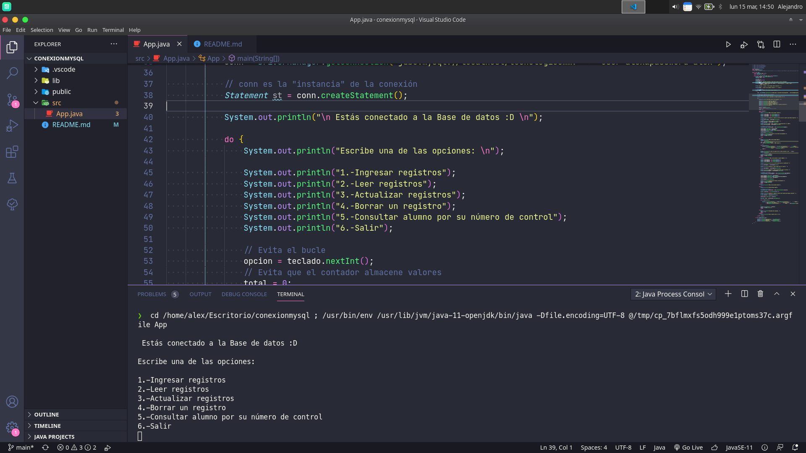
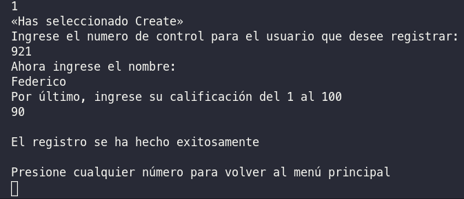
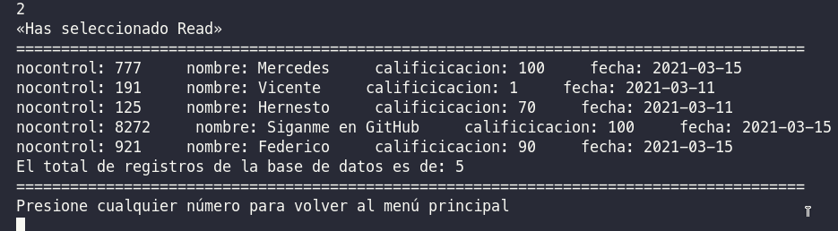
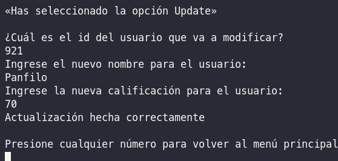
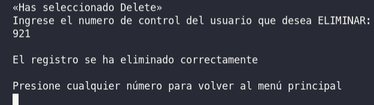
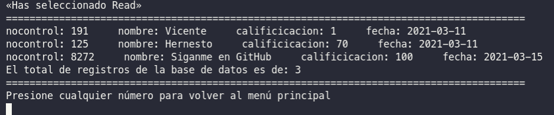
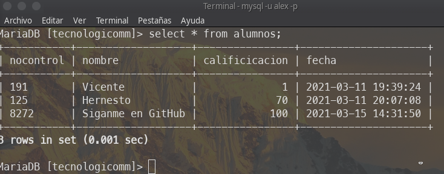

## Paquete necesario para que funcione

mysql-connector-java-8.0.23

Link de descarga `https://dev.mysql.com/downloads/connector/j/`

## Folder Structure

The workspace contains two folders by default, where:

- `src`: the folder to maintain sources
- `lib`: the folder to maintain dependencies

## Dependency Management

The `JAVA DEPENDENCIES` view allows you to manage your dependencies. More details can be found [here](https://github.com/microsoft/vscode-java-pack/blob/master/release-notes/v0.9.0.md#work-with-jar-files-directly).

### Menú de opciones:

### Create

### Read

### Update

### Delete

## Demostración final (consola vsc)

## Demostración final (consola propia de linux)

